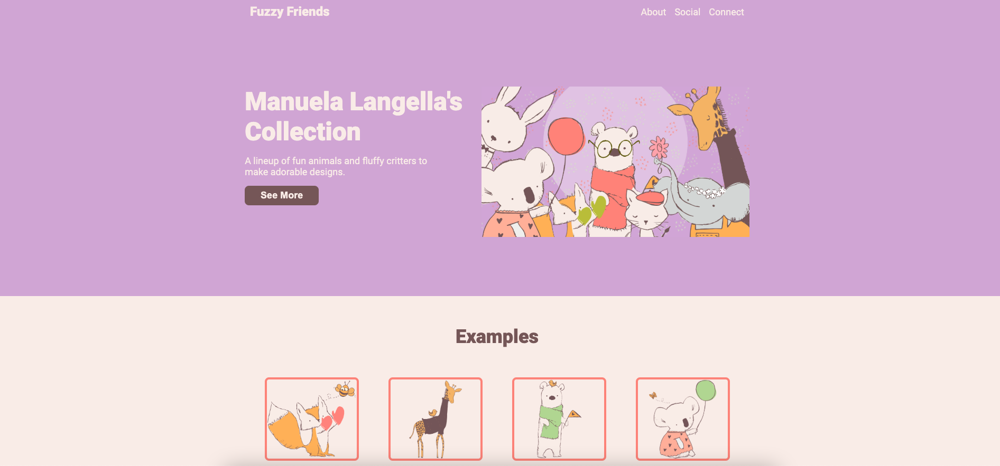
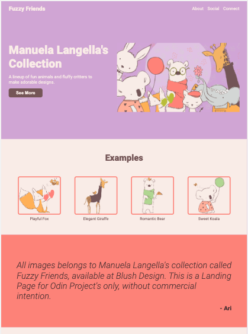
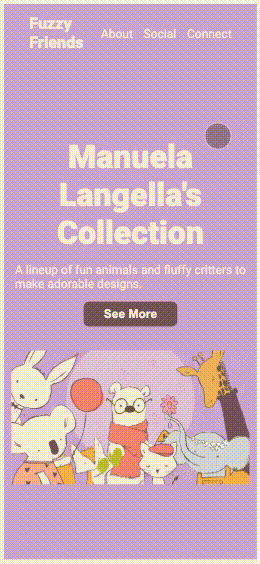

# Odin Landing Page

Assignment from The Odin Project - Foundations

# Overview

Live Demo: <a href="https://ariferreira/odin-landing-page/" target="_blank" noreferrer>Odin Landing Page</a>

Screenshot from Odin Landing Page - Desktop
 
 

 
Screenshot from Odin Landing Page - Tablet
 
 

 
Video from Odin Landing Page - Mobile

## Overview

This assignment <a href="https://www.theodinproject.com/lessons/foundations-landing-page" target="_blank" noreferrer>Project: Landing Page</a> was set as part of the <a href="https://www.theodinproject.com/" target="_blank" noreferrer> The Odin Project</a> curriculum. This is a simple landing page that showcases Manuela Langella's work <a href="https://blush.design/pt/collections/aarkKHQ2eBWDgSC0A3U6/fuzzy-friends-illustrations" target="_blank" noreferrer> Fuzzy Friends</a>.

## Considerations

Project was fairly basic and easy. Just to practice HTML knowledge acquired from foundations. Great to refresh memory and later practiced and added CSS properties, especially for mobile and tablet view. :smiley:
